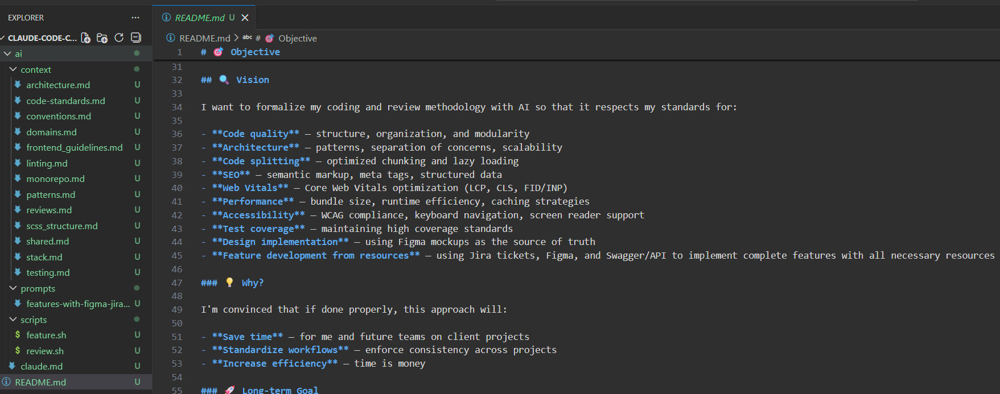

# Claude Code — Context & Skills Réutilisables

Système d'injection de contexte pour Claude Code. Formalise les standards de code, l'architecture, et la méthodologie de review en fichiers markdown — chargés sélectivement selon la tâche.

**Résultat :** Claude comprend ton stack, respecte ton architecture, applique tes standards, et review le code comme toi — sans répétition à chaque prompt.

---

## Structure

```
ai/
├── claude.md              Orchestrateur principal — détection de mode, activation des rôles
├── context/               24 fichiers de standards techniques (chargés sélectivement)
│   ├── _index.md          Index de référence rapide
│   └── ...
└── skills/                Tout ce qui définit le comportement de Claude
    ├── roles/             Rôles spécialisés — adoptés selon le mode détecté
    │   ├── architecte.md      Placement DDD, bounded contexts
    │   ├── implementeur.md    Rédaction de code, ordre d'implémentation
    │   ├── reviewer.md        Review 14 critères, verdict de merge
    │   ├── testeur.md         Pyramide de tests, coverage ≥ 80%
    │   ├── debugger.md        Investigation cause racine, fix minimal
    │   ├── securite.md        Surface d'attaque, règles absolues
    │   ├── accessibilite.md   WCAG 2.1 AA, 8 blockers
    │   ├── performance.md     LCP / INP / CLS, profiling first
    │   └── qa.md              4 axes qualité, standards
    └── comportements/     Comportements permanents de Claude
    ├── anti-sycophancy.md    Priorité à la vérité, pas à l'accord
    ├── anti-hallucination.md Déclaration d'incertitude explicite
    └── conversation-naturelle.md  Style humain, pas robotique
```

---

## Comment ça fonctionne

### 1. Détection de mode automatique

Claude détecte le mode depuis la requête et charge uniquement les fichiers nécessaires.

| Requête | Mode activé |
|---------|-------------|
| "ajoute une feature de paiement" | FEATURE |
| "review ce PR" | REVIEW |
| "refactorise ce hook" | REFACTOR |
| "écris les tests pour ce composant" | TEST |
| "ce bouton ne fonctionne plus" | DEBUG |
| "le LCP est à 4s" | PERFORMANCE |
| "où mettre ce service ?" | ARCHITECTURE |
| "migre de Redux vers Zustand" | MIGRATION |
| "explique ce pattern" | DOC |

### 2. Orchestration de sous-agents

Selon le mode, Claude adopte des rôles séquentiels ou spawn des sous-agents parallèles.

**Exemple — MODE REVIEW :**

```
Claude spawne 4 agents simultanément :
  ├── Reviewer     → 14 critères standards
  ├── Sécurité     → scan surface d'attaque
  ├── Accessibilité → WCAG 2.1 AA
  └── Performance  → Core Web Vitals

→ Synthèse consolidée : 🚫 BLOCKERS / ⚠️ WARNINGS / ℹ️ INFO
```

**Exemple — MODE FEATURE :**

```
Phase 1 (bloquante) : Architecte valide le placement DDD
Phase 2 (séquentielle) : Implémenteur code dans l'ordre strict
Phase 3 (parallèle) : QA + Sécurité + Accessibilité en simultané
```

### 3. Comportements permanents

`anti-sycophancy` et `anti-hallucination` sont toujours actifs — Claude priorise la vérité sur l'accord, et déclare son incertitude plutôt que d'inventer.

---

## Règles Non-Négociables

Présentes dans chaque mode, impossible de les bypass :

- Aucun token/secret en localStorage ou env vars client
- Jamais `` — toujours `next/image`
- Jamais de composant React basé sur classe
- Jamais d'import cross-domain
- Jamais `dangerouslySetInnerHTML` sans `DOMPurify.sanitize()`
- Aucune nouvelle dépendance sans justification bundle size
- Coverage ≥ 80%, jamais en baisse

---

## Adapter à ton projet

### Contexte technique (`ai/context/`)

Modifier ou remplacer les fichiers selon ton stack :
- `stack.md` → liste ton framework, tes librairies, tes interdictions
- `architecture.md` → ta structure de projet (pas nécessairement DDD)
- `conventions.md` → tes conventions de nommage
- `reviews.md` → tes critères de review

### Rôles (`ai/roles/`)

Les rôles sont indépendants et modulables. Tu peux en ajouter, modifier les checklists, ou ajuster les seuils (ex : coverage à 90% au lieu de 80%).

### Comportements (`ai/comportements/`)

- `anti-sycophancy.md` et `anti-hallucination.md` : recommandés en permanent
- `conversation-naturelle.md` : activer quand tu veux discuter sans mode technique

---

## Intégration avec outils projet

Objectif exploratoire : connecter Claude Code directement aux ressources internes.

| Outil | Usage |
|-------|-------|
| **Jira** | Lire les tickets pour extraire les critères d'acceptance |
| **Figma** | Valider l'implémentation contre les maquettes |
| **Swagger / OpenAPI** | Générer les types TS et les appels API |
| **GitLab / GitHub MR** | Review automatique via lien de MR |

**Exemples de prompts :**
- `"Implémente la feature décrite dans ce ticket Jira : [lien]"`
- `"Review cette MR en respectant les standards du projet : [lien]"`
- `"Génère les types TS depuis ce swagger : [lien]"`

---

## Ce que ce projet n'est pas

Ce n'est pas du RAG (Retrieval-Augmented Generation).

Le RAG gère de grands volumes de données via des APIs et bases vectorielles. Ici, c'est de l'**injection de contexte par fichiers** — les standards sont fournis directement comme contexte, chargés sélectivement selon la tâche. Plus simple, plus prévisible, plus adapté aux standards d'équipe.
